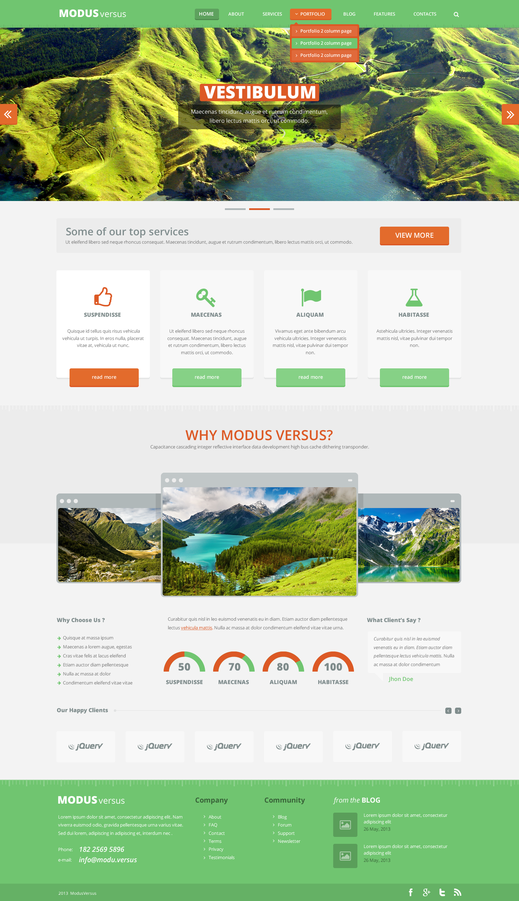

# portfolio-mockup
took a random mock-up, turned into a page to prove my html/css skills

I used Dimitar Tsankov's free template <a href="https://www.webdesignerdepot.com/2013/06/free-psd-template-modus-versus/">Modus Versus</a>.
It comes in 3 color schemes and details all the insides of a could-be website, there are 12 PSDs in an archive.
I only made the front page, making mock-ups for portfolio is kinda boring.

This is how it's supposed to look

